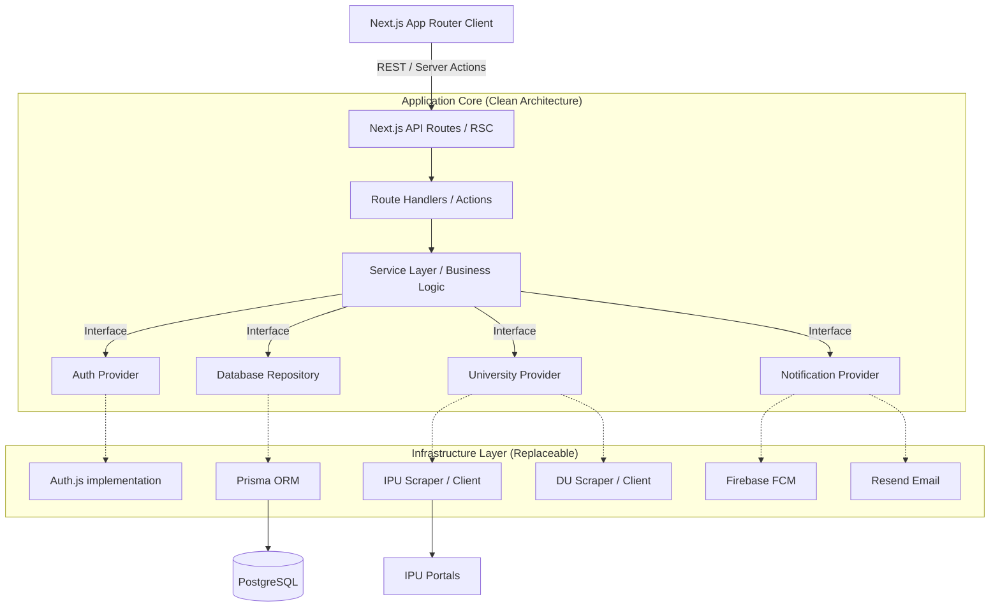

# Academic Analytics Platform: Architectural Foundation

This document outlines the architectural blueprint for a production-grade Academic Analytics Platform. The design emphasizes clean architecture, strict modularity, and heavily abstracted infrastructure. The primary goal is to ensure the platform can scale from a single university (IPU) to any university globally without rewriting core business logic.

---

## 1. Overall Architecture Diagram



---

## 2. Folder Structure

We use a **Feature-Sliced Architecture** adapted for Next.js App Router. Domain logic is heavily isolated from routing and generic UI.

```text
/src
  /app                  # Next.js Routing, Pages, and Layouts ONLY
    /(auth)             # Grouped auth routes
    /(dashboard)        # Grouped dashboard routes
    /api                # Edge/Node API Routes
  /core                 # Core domain entities and rules
    /entities           # Pure TS representations of domain objects
    /errors             # Custom application error classes
  /features             # Domain-specific modules
    /analytics          # Components, hooks, services for charts
    /academic-records   # Logic for GPAs, subjects, semesters
    /student-profile    # Student data management
  /infrastructure       # Implementations of external systems
    /database           # Prisma client and repositories
    /providers
      /university       # IUniversityProvider implementations (IPU, etc.)
      /email            # IEmailProvider implementations (Resend)
      /auth             # Auth.js configurations
  /shared               # Shared generic resources
    /ui                 # shadcn/ui generic components
    /lib                # cn(), generic formatting utilities
```

---

## 3. Module Breakdown

1.  **Authentication Module:** Manages session lifecycle, OAuth handshakes, and JWT issuance. Completely unaware of *how* the user authenticates (abstracted by Auth.js).
2.  **University Integration Engine (Scraper/API):** The core engine that resolves a student's university, loads the correct Provider Strategy, and normalizes disparate university data into our standard `SemesterResult` entity.
3.  **Academic Records Module:** Handles calculations (CGPA, SGPA), historical tracking, and caching of normalized university data.
4.  **Analytics Module:** Consumes data from the Academic Records module to generate Recharts-compatible data structures for trend lines and distributions.
5.  **Notification Module:** A decoupled worker/service that listens to "Result Published" events and fans out notifications via the injected Notification Provider.

---

## 4. Feature Roadmap

*   **Phase 1 (MVP - Foundation):**
    *   Auth.js setup (Google/Email).
    *   University Provider abstraction with `IPUProvider` implemented.
    *   Result scraping/parsing for IPU.
    *   Basic Dashboard with Recharts (CGPA/SGPA trends).
*   **Phase 2 (Engagement & Scale):**
    *   Result release push notifications.
    *   Subject-wise analytical breakdowns and class rank estimations.
    *   Addition of a second university (e.g., DUProvider) to validate the abstraction architecture.
*   **Phase 3 (Ecosystem):**
    *   Public shareable profiles.
    *   Resume parsing and career tracking.
    *   Platform APIs for external developers.

---

## 5. Database Entity List (Abstracted)

*   **User:** Core identity (Email, Role, Status).
*   **Account:** OAuth connection mapping (Google, Microsoft).
*   **Session:** Active session tracking.
*   **StudentProfile:** Domain-specific user data (Enrollment Number, University ID, Program/Major, Batch Year).
*   **University:** Configurable metadata for supported universities (Name, Active Status, Features Supported).
*   **SemesterResult:** Normalized performance for a specific term (Term Number, SGPA, Total Credits).
*   **CourseResult:** Granular normalized result for a specific subject within a semester (Subject Name, Grade, Internal Marks, External Marks).

---

## 6. Service Layer Design

The Service Layer acts as the orchestrator. It uses **Dependency Injection (or Factory Patterns in TS)** to utilize infrastructure. 

```typescript
// core/interfaces/university-provider.interface.ts
export interface IUniversityProvider {
  getProviderId(): string;
  verifyStudent(enrollmentNo: string): Promise<boolean>;
  fetchLatestResults(enrollmentNo: string, credentials?: any): Promise<SemesterResult[]>;
}

// infrastructure/providers/university/university-factory.ts
export class UniversityProviderFactory {
  static getProvider(universityId: string): IUniversityProvider {
    switch(universityId) {
      case 'IPU': return new IPUProvider();
      case 'DU': return new DUProvider();
      default: throw new UnsupportedUniversityError(universityId);
    }
  }
}
```

---

## 7. API Route Plan

API Routes are strictly standard REST mapped to Next.js App Router handlers.

*   `POST /api/v1/auth/*` - Handled natively by Auth.js.
*   `GET /api/v1/profile` - Fetch unified student profile.
*   `POST /api/v1/universities/sync` - Triggers a background sync using the appropriate University Provider.
*   `GET /api/v1/results` - Fetch cached, normalized academic records from our Postgres DB (does not hit the university directly).
*   `GET /api/v1/analytics/trends` - Aggregated data shaped specifically for the Recharts UI.

---

## 8. State Management Plan

*   **Server State:** React Query (`@tanstack/react-query`) is used for all asynchronous data fetching, caching, and synchronization.
*   **UI/Local State:** Zustand is used for minimal global UI state (e.g., sidebar toggles, global modal states).
*   **Form State:** React Hook Form + Zod for strict type-safe validation.
*   **URL State:** Standard URL Search Params are used for filter states (e.g., `?semester=4`) so charts are shareable and bookmarkable.

---

## 9. Security Architecture

*   **Authentication:** JWT-based stateless sessions managed via Auth.js. 
*   **Authorization:** Middleware edge-checks for valid JWTs. Role-based access control (RBAC) enforced at the Route Handler level.
*   **Data Isolation:** Logical Row-Level Security. Every database query in the Service layer strictly includes `where: { userId: currentUser.id }`.
*   **Scraper Security:** University API scraping/calls are proxied through a rotating IP pool or background workers to prevent the platform's Vercel IPs from being blacklisted by universities. No university passwords are ever stored in plain text; if required, they are AES-256 encrypted.

---

## 10. Error Handling Strategy

*   **Domain Errors:** Custom classes extending `Error` (e.g., `ResultNotPublishedError`, `ScrapingTimeoutError`).
*   **API Boundary:** A centralized Next.js error wrapper catches domain errors and translates them into standardized HTTP responses `{ success: false, code: "UNAUTHORIZED", message: "..." }`.
*   **UI Boundary:** React Error Boundaries capture rendering crashes. React Query automatically handles retry logic and provides `isError` flags for graceful fallback UI rendering.

---

## 11. Logging Strategy

*   **Library:** Pino (for lightweight, high-performance structured JSON logging).
*   **Context:** Every request is assigned a `requestId`. This ID is passed through the service layer to trace multi-step provider scraping processes.
*   **External Sink:** Logs are output to `stdout` and collected by the hosting provider (e.g., Vercel Log Drains) to be forwarded to Datadog or Axiom.

---

## 12. Future Scalability Plan

*   **Compute:** Next.js deployed on Vercel provides stateless, auto-scaling edge and serverless compute.
*   **Database:** Start with standard Postgres. As reads scale (e.g., thousands of students checking results simultaneously on result day), introduce Prisma Accelerate or PgBouncer for connection pooling, and Redis for caching the `SemesterResult` payloads.
*   **Scraping:** Scraping is CPU and network intensive. Long-term, `fetchLatestResults` will publish to an SQS/Upstash Kafka queue, and dedicated worker microservices (written in Go or Node) will handle the actual scraping, freeing the Next.js API to remain highly responsive.

---

## 13. Coding Standards

*   **Strict Typing:** `strict: true` in `tsconfig.json`. `any` is strictly forbidden unless interacting with legacy unknown payloads.
*   **Immutability:** Pure functions are preferred. Array/Object mutations are avoided.
*   **Early Returns:** Guard clauses are mandated to prevent deep nesting of `if/else` statements.
*   **Linting:** Prettier + ESLint with `eslint-config-next` and strict import-sorting rules.

---

## 14. Naming Conventions

*   **Components & Interfaces:** `PascalCase` (e.g., `DashboardChart`, `IUniversityProvider`).
*   **Functions & Variables:** `camelCase` (e.g., `calculateCgpa`, `studentData`).
*   **Constants:** `UPPER_SNAKE_CASE` (e.g., `MAX_RETRY_ATTEMPTS`).
*   **Files:** `kebab-case` (e.g., `result-parser.service.ts`, `dashboard-page.tsx`).

---

## 15. Design System Guidelines

*   **Methodology:** Modified Atomic Design.
*   **Foundation:** shadcn/ui provides accessible, unstyled primitives.
*   **Styling:** Tailwind CSS strictly used. No separate CSS files (except the global entry point). 
*   **Motion:** Framer Motion used sparingly for layout transitions and micro-interactions (e.g., expanding result cards, entering charts) to make the academic data feel premium.
*   **Theming:** Centralized CSS variables in `index.css` mapped to Tailwind configuration to allow easy switching between light/dark or university-specific color brands.

---

## 16. Deployment Strategy

*   **Pipeline:** GitHub Actions handles CI (Linting, TypeScript compilation, Unit Tests).
*   **Preview:** Vercel automatically generates isolated preview URLs for every Pull Request.
*   **Database Migrations:** Prisma migrations are run automatically during the CI/CD deployment phase before traffic shifts.
*   **Release:** Main branch deployments are instantly promoted to production if all checks pass.

---

## 17. Environment Variable Strategy

*   **Validation:** `@t3-oss/env-nextjs` (Zod) is used to validate all environment variables at boot time. The app will intentionally crash at startup if required variables are missing.
*   **Separation:** 
    *   `.env.example`: Committed to source control. Contains safe defaults and keys without values.
    *   `.env.local`: Ignored by Git, used by developers locally.
    *   Vercel Environment variables panel manages staging/production keys securely.
*   **Abstractions:** Code never references `process.env.PROVIDER_KEY` directly; it imports from a centralized `env.mjs` file containing the Zod schema.

---

## 18. Architectural Decisions & The "Why"

*   **Why Next.js App Router?** It provides the fastest time-to-market for full-stack React applications, offering RSCs (React Server Components) which drastically reduce the JavaScript bundle size shipped to mobile devices (where 90% of students will view their results).
*   **Why Prisma?** Unmatched developer experience and type safety. Given that our schema will heavily revolve around normalized academic data, type safety from database to client is non-negotiable.
*   **Why Abstract Everything (Providers)?** University systems are notoriously brittle and diverse. IPU might use a legacy SOAP API, while DU might use a standard REST portal, and another might require raw HTML puppeteer scraping. By forcing all these into an `IUniversityProvider` interface that returns a unified `SemesterResult`, the UI and Analytics modules never have to care *how* the data was obtained. This isolates the brittle scraping logic from the pristine UI logic.
*   **Why shadcn/ui + Tailwind?** Absolute control over the design system without being locked into a bloated component library. It allows us to build a distinctive, premium feel (like Stripe/Linear) while maintaining high accessibility.
